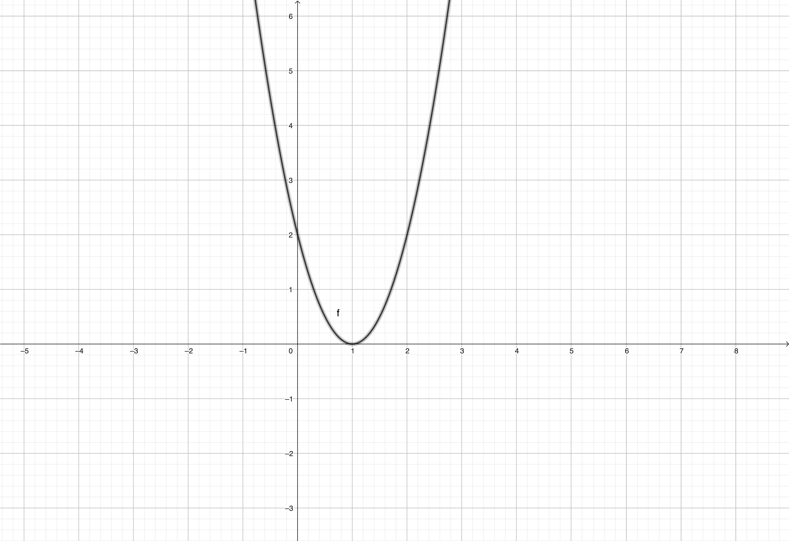

# Quadratic Equations and Parabolas

Quadratic equations are polynomial equations of the second degree, commonly written in the form:

```math
ax^2 + bx + c = 0
```

where $`a`$, $`b`$, and $`c`$ are constants, and $`x`$ represents the variable.

## The Quadratic Formula

The solutions to a quadratic equation can be found using the quadratic formula:

```math
x = \frac{{-b \pm \sqrt{{b^2 - 4ac}}}}{{2a}}
```

## Relationship with Parabolas

Quadratic equations are closely related to the graph of a parabola. The general form of a quadratic equation can be expressed as:

```math
f(x) = ax^2 + bx + c
```

The graph of this equation is a parabola, which can open upwards or downwards depending on the sign of $`a`$. 

- If $`a > 0`$, the parabola opens upwards.
- If $`a < 0`$, the parabola opens downwards.

## Example

Consider the quadratic equation $`y = 2x^2 - 4x + 2`$.

```math
y = 2x^2 - 4x + 2
```

The corresponding parabola opens upwards because $`a = 2 > 0`$.

### Drawing of the Parabola

```math
\begin{align*}
f(x) &= 2x^2 - 4x + 2 \\
&= 2(x^2 - 2x) + 2 \\
&= 2(x^2 - 2x + 1) + 2 - 2 \\
&= 2(x - 1)^2 + 0
\end{align*}
```

```math
\text{Vertex form: } f(x) = a(x - h)^2 + k
```

In this form, the vertex of the parabola is at $`(h, k)`$. For our example, the vertex is $`(1, 0)`$.

```math
\text{Vertex: } (1, 0)
```

The vertex form allows us to easily identify the vertex and understand the direction in which the parabola opens.

### Graph



This graph represents the parabola $`y = 2x^2 - 4x + 2`$, with the vertex at $`(1, 0)`$ and an upward opening.
