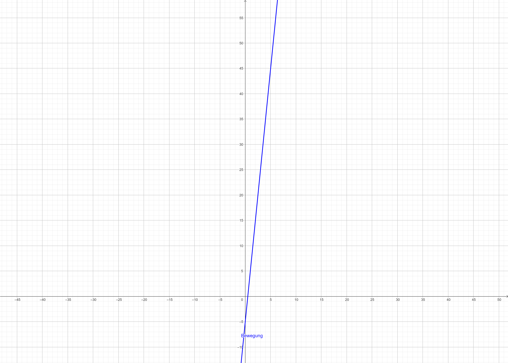

# Kinematics 1D

1. Skipped

2. Car moves 50m in 5s
   a. $\displaystyle v = \frac{m}{s} = \frac{50}{2} = 10\frac{m}{s}$
   b. 
   c. Bei der Hälfte

3. Sportscar accelerates in 3rd gear from $48.3 km/h$ to $80.5 km/h$ within $3.7s$
   1. How big is his average acceleration?
       - $\delta v = v_E - v_A = 80.5km/h - 48.3km/h = 32.2km/h$
       - $a = \frac{v_E - v_A}{t} = \frac{(80.5km/h - 48.3km/h)/3.6}{3.7s} = \underline{\underline{2.42m/s}}$
   2. How fast would it be, if it accelerated at that pace for an hour?
       - $1h = 3600s$
       - $80.5km/h / 3.6 = 22.36m/s$
       - $\displaystyle v_E = v_A + a_m * t = 22.36m/s + 2.42m/s * 3600s = \underline{\underline{8725 m/s}}$

4. Car starts from standing. Endspeed is $30m/s$, drives for $10s$.
   1. How far did it drive?
      - $\overline{v} = v_E / 2 = 30m/s / 2 = 15m/s$
      - $s_Auto = \overline{v} * t = 15m/s * 10s = \underline{\underline{150m}}$

5. Car starts from standing. Constant acceleration of $1m/s^2$.
   1. Which distance $s$ did the car cover, if it's end velocity $v_E$ is $5 m/s$
   - $\displaystyle s=\frac{v_E^2-v_A^2}{2a}=\frac{5^2m/s}{2m/s^2}=\frac{25m/s}{2m/s^2}=\underline{\underline{12.5m}}$

6. Car starts from standing. Starts $10m$ behind the origin and reaches $60m$ in $10s$
   1. What is it's average speed?
      - $\overline{v} = s / t = 60m / 10s = \underline{\underline{6 m/s}} $
   2. Which Position $s$ does the Car have compared to the origin?
      - $s_T = s - s_U = 60m - 10m = \underline{\underline{50m}}$

7. What is the velocity $v$ of a Car, that is already driving at $v_A=10m/s$ and accelerates at $0.1m/s^2$ for $10$ seconds?
   1. What is it's endvelocity $v_E$?
      - $v_E=v_A+a\*t=10m/s+0.1m/s^2*10=\underline{\underline{11m/s}}$
